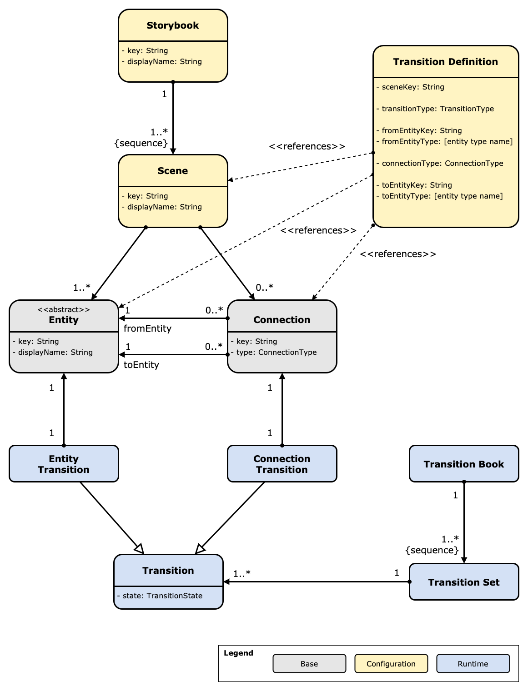

# Domain Architecture Landscape
A **modeling tool to generate diagrams** for an IT domain architecture landscape.
The main goal is that we as IT architects don't need to handcraft the diagrams ourselves.
Instead we can model all information in a structured way, following the domain model implemented in the tool, and then hand over the painstaking and error-prone diagram creation work to the machine.

## What are the key features?

The dalandscape tool (from now on just called "the tool") allows you to model several aspects of information relevant for an IT domain architecture landscape (from now on just called "the landscape").
Such a landscape consists of systems, system components, users, boundaries, dependencies, and the like.
In addition, you can model the changes over time which have been or will be applied to the landscape.
The actual goal of the tool is that - once you have defined all the information - it can create a plethora of system diagrams for you. 

So, there are two aspects which the tool covers: defining a landscape, and based on such landscape, defining the changes over time.
The following two sections provide some more details.

### Aspect 1: Define a landscape

The landscape itself consists of the following parts:

* **Systems**, their **system components**, and how these are **connected to each other**,
* **Users** and the systems they interact with.
* **Boundaries** which contain certain groups of systems. A typical example for such boundaries are the several DMZs which separate certain systems from each other.
* **Use cases**, categorized in groups, and how these are **related to system components**.
* **Teams**, their team members, and how they are **responsible for systems and system components**, and hence also **for use cases**.

Once you have put the information into the model, the tool can already create several types of diagrams which provide you with a visual representation of the information.

### Aspect 2: Define the changes over time applied to the landscape

The features mentioned so far in the previous section allow you to model a snapshot of such a landscape at a given point in time, and have the tool create diagrams which visualize the information.
While these diagrams already help the IT architect to communicate with others, it does not cover one of the main tasks of an architect: communicate the changes of the landscape over time.

Therefore, the tool also allows you to model the **transitions applied on a given landscape** over time, and then automagically create diagrams which calculate the differences between the transition steps.

You can model the transitions not only for the **entities** (like systems, system components, and users), but also for the **connections** between these entities.

As a result, the tool creates a sequence of diagrams (a "flip-book") showing which changes happen in which step.
Such a **flip-book** can support you when you need to explain the various steps of an landscape migration (and maybe answers the question why the heck this always takes so long :-)).

## This is too abstract for my taste - don't you have an example?

Glad that you asked :-) 
Please check the [showcase example](showcase.md) which demonstrates the features based on a fictious bank's landscape.

## The domain model

The heart of the tool is a domain model which tells us which types of entities and connections exist and how everything is related to each other.
In this section we describe this domain model.
As there are two aspects (landscape, and the transitions of landscapes), we split the model also in two parts.

### Modeling a landscape

As already mentioned above, a landscape consists of entities like systems, use cases, teams, and connections between these entities.

Following diagram shows the concrete domain model for this, as some kind of class diagram.
To increase readability, the diagram does not show cardinalities.
And because the cardinality of all associations is "0..*", adding the cardinality information would anyway not add much value.

If you use this domain model, you can create information as a basis for questions like the following:

* Which **systems** belong to the given landscape?
* How are all the systems **connected to each other**?
* Which **users** interact with which of these systems?
* Do the systems belong to any **boundaries** (e.g., are the systems separated by various networks)?
* Which **system components** does a given **system consist of**?
* What are the **dependencies between system components**?
* Which **use cases** does a given **system component implement**? 
* Which **teams** are **responsible** for which **use cases**?
* Which **use cases** does a given system implement?

This model so far is quite straightforward, and maybe this is something you might have expected.
But this model so far does not allow to define transitions which happen to the landscape over time.

To accomplish this we need to extend the model.
As a preparation for this second aspect in which we need to describe transitions of such landscapes, we first need to introduce an underlying base model.

The following class diagram shows this base model.

Basically, this base model just describes a **graph structure** in which **two entities** can (but not need to) be connected to each other with a direction from one entity to the other entity.

The important part here is that we define the connection between two entities as a first class citizen itself.
With this model we can create instances of connections and give them an identity.
Having an identity is mandatory to be able to define transitions which not only include the entities, but the connections as well.

Well, now that we have defined this base model, we can head back to the first diagram and complete the explanations:

* **Each of the entities shown there are concrete subclasses of the abstract class "Entity".**
That means that each of the concrete entities like "System" or "User" all have at least a String attibute "key" and another String attribute "displayName".
As you will see later when the tool is in action,
  * String attribute "**key**" is used as an internal identifier, whereas
  * String attribute "**displayName**" appears in any of the created diagrams.
* **Each of the connection arrows shown there are in reality concrete instances of "Connection".**
Again, there are two attributes:
  * String attribute "**key**" is used as an internal identifier.
  * The attribute "**type**" is an enum called **"ConnectionType"** with the following possible values:
    * CONNECTS_TO
    * CONTAINS
    * DEPENDS_ON
    * IMPLEMENTS
    * RESPONSIBLE_FOR

If we would stop with our model at this point, we could define snapshots of complete landscapes, and this would be already nice.
But of course we also want to have this flip-book feature, and therefore we continue with the next section :-)

### Modeling the landscape transitions

In order to be able to create flip-books, the tool needs an extension of the domain model explained so far.
A flip-book shows the different steps which show the transition of the landscape over time.
As the tool (unfortunately) cannot do magic, we need to provide corresponding information which describe the various transitions.

The following diagram shows the extension of the existing domain model.

You see the two base model classes "Entity" and "Connection" in the middle, and because all of the classes defined in the first model like "System", "User", or "Team" extend from these two classes, this model below contains in fact already everything.

You'll notice three types of classes:

* **Base**: As already mentioned above, these two classes "Entity" and "Connection" build the foundation of the complete model.
* **Configuration**: Whenever a class is marked as a configuration class, you as the architect need to provide the information.
For example, you need to define the various instances of "System", "User", "Team", and so on.
* **Runtime**: If you have configured your concrete landscape and transitions, the tool then takes this information, calculates the derived information, and then takes both configuration and runtime instances to finally create all the diagrams.

Some of these classes have non-string attributes which we now explain:

* Class **"Transition"** contains
  * attribute **"state"** of enum **"TransitionState"**:
    * STAYS_UNCHANGED
    * WILL_BE_ADDED
    * WILL_BE_REMOVED
* Class **"Transition Definition"** contains
  * attribute **"transitionType"** of enum **"TransitionType"**:
    * ADD
    * REMOVE
  * attribute **"connectionType"** of enum **"ConnectionType"**. This is the same type as we have already defined for the base class "Connection". Please check the section above for the concrete values of this enum.
  * attributes **"fromEntityType"** and **"toEntityType"**. These two attributes are in fact Strings, but the tool logic binds them to well-defined, enum-like values, namely the names of the concrete class of the entity which the transition definition refers two.

Let us conclude the definition of the domain model with the insight that we are well aware of the irony that we need to handcraft this model despite the fact that tool's main purpose is to actually prevent us from such diagram handcrafting :-)

By the way: You can find the complete domain model defined in one PlantUML diagram - [see file "domainmodel.puml"](src/main/resources/domainmodel.puml).

## How can I run it?

If you want to run the tooling, you need to have
* this Git repository (or at least its folders and files),
* a JDK installed, at least version 8 (we have implemented this with version 13),
* Maven (a not too old version - we have used 3.6.3), and
* an Internet connection to be able to load all the dependee libraries.

If you also want to get diagram files in SVG and PNG, you need to also have GraphViz installed.
Unfortunately, older versions create ugly diagrams.
So please use the latest version.

To start the whole thing, you need to run

    mvn spring-boot:run
    
If everything runs as intended, you will find the generated PlantUML diagram files (.puml) located in the "./target" subfolder.

If you want to go one step further, run

    mvn verify
    
This will take a little longer, but it will create SVG and PNG files in the "./target" subfolder, next to the PlantUML files.

If you want to know details about the features implemented in the released versions, please check CHANGELOG.md.
For the current snapshot version it might happen that the documentation in CHANGELOG.md is not complete ;-)